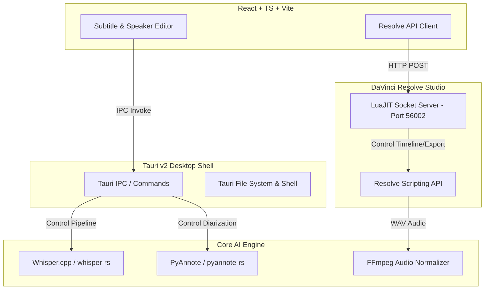
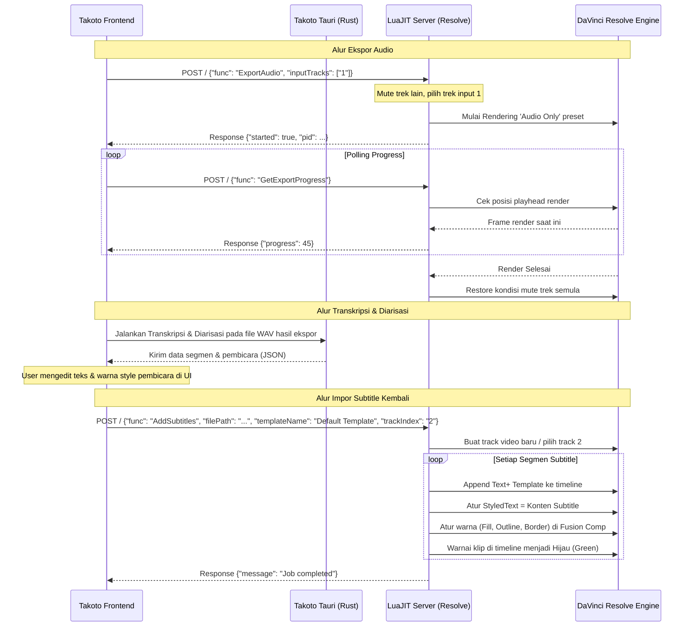

# Dokumentasi Lengkap & Mendetail Projek Takoto

Selamat datang di dokumentasi resmi **Takoto**, aplikasi pembuat subtitle otomatis yang cepat, akurat, dan dapat disesuaikan sepenuhnya. Takoto dirancang untuk kreator konten, video editor, dan pengembang yang membutuhkan solusi transkripsi dan diarisasi pembicara (speaker diarization) berkualitas tinggi, baik sebagai aplikasi mandiri (*Standalone*) maupun terintegrasi langsung dengan **DaVinci Resolve**.

---

## 1. Pendahuluan & Ringkasan Eksekutif

Takoto memecahkan masalah pembuatan subtitle tradisional yang memakan waktu dengan menawarkan alur kerja transkripsi sekali klik (*one-click*). Aplikasi ini menggabungkan performa tinggi bahasa pemrograman Rust di sisi backend dengan fleksibilitas antarmuka pengguna modern berbasis React dan Tauri di frontend.

### Fitur Utama Takoto:
*   **Transkripsi Cepat & Akurat**: Menggunakan engine Whisper (via `whisper.cpp`) untuk transkripsi multi-bahasa dengan dukungan akselerasi GPU (CoreML/Metal di macOS, Vulkan/DirectML di Windows).
*   **Diarisasi Pembicara (Speaker Diarization)**: Mengelompokkan teks berdasarkan pembicara menggunakan model PyAnnote (ONNX Runtime) secara lokal tanpa mengirim data ke cloud.
*   **Integrasi DaVinci Resolve**: Koneksi dua arah yang mulus untuk mengekspor audio dari timeline Resolve dan mengirimkan kembali subtitle berupa klip Text+ yang sudah terformat dan diwarnai sesuai pembicara.
*   **Editor Subtitle & Speaker**: Antarmuka visual intuitif untuk mengedit transkrip, menyelaraskan waktu, menyesuaikan gaya teks per-speaker (warna fill, outline, border), dan melihat pratinjau langsung (*live preview*).
*   **Aplikasi Standalone**: Dapat memproses file audio/video secara mandiri untuk mengekspor file subtitle standar (SRT, VTT) tanpa memerlukan DaVinci Resolve.

---

## 2. Arsitektur Sistem (System Architecture)

Takoto menggunakan arsitektur modular yang membagi tanggung jawab antara antarmuka pengguna (Frontend), aplikasi desktop wrapper (Tauri Shell), mesin AI (Rust Backend), dan integrasi editor video (DaVinci Resolve Script).



### Penjelasan Komponen:

1.  **Frontend (React + TypeScript + Vite + Tailwind CSS + Shadcn UI)**
    *   Berjalan di dalam webview Tauri.
    *   Menyediakan antarmuka interaktif seperti *timeline viewer*, *speaker customization panels*, *diagnostics logs*, dan panduan instalasi (*setup walkthrough*).
    *   Menggunakan API Client (`resolveAPI.ts`) untuk mengirim perintah HTTP ke server integrasi DaVinci Resolve.

2.  **Desktop App Shell (Tauri v2)**
    *   Mengatur window aplikasi, akses file sistem lokal, dan dialog pemilihan file.
    *   Mengelola *sidecar processes* (FFmpeg/FFprobe) untuk konversi audio tanpa dependensi eksternal.
    *   Menghubungkan frontend ke fungsi backend Rust melalui Tauri IPC `invoke_handler`.

3.  **Core AI Backend (Rust)**
    *   **Transkripsi**: Menggunakan library Rust `whisper-rs` yang mengikat *binding* C/C++ dari `whisper.cpp`. Fitur akselerasi perangkat keras diaktifkan secara otomatis (seperti CoreML di macOS Apple Silicon).
    *   **Diarisasi Pembicara**: Menggunakan `pyannote-rs` yang menjalankan model segmentasi dan ekstraksi embedding pembicara menggunakan ONNX Runtime (`ort-sys`).
    *   **Pemrosesan Audio**: Memvalidasi spesifikasi file input dan melakukan normalisasi menggunakan FFmpeg (mengubah audio menjadi format standar PCM 16-bit 16kHz mono WAV yang dibutuhkan Whisper).

4.  **Integrasi DaVinci Resolve (LuaJIT + FFI Socket Server)**
    *   Skrip `Takoto.lua` diletakkan di direktori skrip utilitas DaVinci Resolve.
    *   Saat dipicu dari menu Resolve, skrip ini membuka socket server TCP non-blocking pada port **56002** dan meluncurkan aplikasi utama Takoto.
    *   Berperan sebagai jembatan untuk mengekstrak audio dari timeline dan menyisipkan klip subtitle baru langsung ke dalam track video editor.

---

## 3. Alur Kerja Utama & Protokol Komunikasi

### A. Mode Standalone (Tanpa Editor Video)
1.  **Pemuatan File**: Pengguna memilih file video atau audio via dialog file Tauri.
2.  **Verifikasi & Normalisasi**: Backend Rust mengecek apakah audio sudah berformat mono 16kHz 16-bit WAV menggunakan *Hound reader*. Jika tidak, backend memanggil FFmpeg secara asinkron untuk menormalkan file tersebut ke cache direktori aplikasi.
3.  **Transkripsi Whisper**: Backend memuat model Whisper yang dipilih (misal: `ggml-small.bin`). Teks transkrip diproses per segmen bersama dengan *word-level timestamps* yang presisi menggunakan metode DTW (Dynamic Time Warping).
4.  **Ekstraksi Diarisasi (Jika diaktifkan)**:
    *   Mengunduh model `segmentation-3.0.onnx` dan `wespeaker_en_voxceleb_CAM++.onnx` jika belum ada.
    *   Mendeteksi aktivitas suara (VAD) dan menghitung embedding suara untuk setiap segmen.
    *   Mengelompokkan embedding menggunakan algoritma clustering lokal untuk menentukan ID pembicara (`Speaker 0`, `Speaker 1`, dst).
5.  **Penyelarasan & Penyuntingan**: Menggabungkan hasil transkripsi dan pembicara, lalu mengirimkannya ke UI. Pengguna dapat mengubah teks, nama pembicara, dan warna.
6.  **Ekspor**: Pengguna mengekspor transkrip ke file SRT atau VTT secara lokal.

### B. Mode DaVinci Resolve (Koneksi Server Socket)
Koneksi antara aplikasi desktop Takoto dan DaVinci Resolve terjadi melalui protokol HTTP REST mini yang berjalan di port `56002`.



---

## 4. Detail Teknis Komponen Backend (Rust)

Backend Rust terletak di direktori `Takoto-App/src-tauri/src/`. Berikut adalah penjelasan mendalam mengenai file-file kuncinya:

### A. Konfigurasi Context & DTW (`transcribe.rs`)
*   **Dynamic Time Warping (DTW)**: Untuk menghasilkan timestamp tingkat kata (*word-level*) yang sangat presisi, Takoto mengaktifkan fitur DTW di `whisper.cpp`. Memori untuk DTW dialokasikan secara dinamis menggunakan fungsi `calculate_dtw_mem_size` berdasarkan durasi audio agar tidak terjadi *out-of-memory* pada audio yang panjang.
*   **Flash Attention**: Jika DTW dinonaktifkan dan GPU digunakan, *Flash Attention* diaktifkan untuk mempercepat proses inferensi.
*   **Alokasi Core CPU**: Menggunakan `std::thread::available_parallelism` dikurangi 1 core untuk memastikan UI/IPC Tauri tetap responsif saat transkripsi berlangsung.

### B. Penyelarasan Transkrip & Pembicara (`transcribe.rs`)
Ketika transkripsi Whisper dan diarisation PyAnnote selesai secara independen, backend melakukan penyelarasan waktu (*alignment*):
1.  Segmen diarisation diurutkan berdasarkan waktu mulai.
2.  Setiap segmen transkrip dicari pasangannya menggunakan **Binary Search** (`binary_search_by`) pada daftar segmen diarisation untuk efisiensi kompleksitas waktu $O(\log N)$.
3.  Menghitung persentase tumpang tindih (*overlap*) antara segmen transkrip dan diarisation. Jika titik tengah transkrip berada di dalam segmen diarisation, segmen tersebut diberi bobot prioritas tinggi untuk menentukan identitas pembicara.

### C. Unduhan & Akselerasi Model (`models.rs`)
*   **Whisper Models**: Diunduh dari Hugging Face API (`ggerganov/whisper.cpp`).
*   **CoreML (macOS)**: Khusus macOS, selain model `.bin`, sistem mengunduh encoder CoreML dalam format ZIP (`ggml-{model}-encoder.mlmodelc.zip`), mengekstraknya menggunakan library `zip`, mengonfigurasi jalur model, dan menghapus file arsip aslinya untuk menghemat ruang penyimpanan.
*   **Pembersihan Lock**: Jika proses unduhan dibatalkan oleh pengguna, sistem menangkap sinyal pembatalan melalui mutex global `SHOULD_CANCEL` dan menghapus file `.lock` yang dibuat oleh `hf-hub` agar tidak mengunci unduhan berikutnya.

### D. Normalisasi Audio (`audio.rs` & `transcribe.rs`)
Fungsi `should_normalize` membaca *header* spesifikasi file audio input menggunakan library `hound`. Normalisasi menggunakan FFmpeg hanya akan dijalankan jika spesifikasi file berbeda dari format target (mono, 16.000 Hz, 16-bit PCM WAV). Hasil normalisasi disimpan dengan nama hash berbasis waktu modifikasi berkas (`generate_cache_key`) untuk menghindari pemrosesan ulang file yang sama.

---

## 5. Detail Teknis Integrasi DaVinci Resolve (Lua)

Kode integrasi ditulis dalam bahasa Lua dan berinteraksi langsung dengan DaVinci Resolve API yang tertanam di dalam editor video tersebut. File utamanya adalah `takoto_core.lua`.

### Fitur Penting Server Lua:
*   **Socket Non-blocking**: Menggunakan modul `ljsocket` untuk mendengarkan permintaan tanpa membekukan (*freezing*) antarmuka DaVinci Resolve.
*   **Manajemen Render Job**: Fungsi `ExportAudio` mengotomatisasi pemrosesan audio timeline:
    1.  Membaca status trek audio aktif saat ini.
    2.  Mematikan (mute) seluruh trek kecuali trek yang dipilih pengguna.
    3.  Beralih ke halaman Deliver (`resolve:OpenPage("deliver")`).
    4.  Memuat preset ekspor bawaan `"Audio Only"`.
    5.  Menentukan parameter output: WAV, 24-bit, 44,1 kHz, dan folder ekspor.
    6.  Menambahkan pekerjaan render (`AddRenderJob`) dan memicu proses rendering (`StartRendering`).
    7.  Setelah render selesai, memulihkan status trek audio semula dan kembali ke halaman Edit.
*   **Penambahan Subtitle ke Timeline**: Fungsi `AddSubtitles` menyisipkan hasil subtitle kembali:
    1.  Membaca berkas JSON hasil transkripsi.
    2.  Mendeteksi FPS timeline Resolve dan FPS template klip subtitle untuk melakukan konversi durasi frame yang akurat.
    3.  Membuat trek video baru jika trek target tidak kosong atau tidak valid.
    4.  Memasukkan klip Text+ (berdasarkan `"Default Template"` atau template kustom di Media Pool) ke posisi timeline yang tepat secara massal menggunakan `mediaPool:AppendToTimeline`.
    5.  Membuka Fusion composition pada setiap klip yang dimasukkan, mencari node bernama `TextPlus`, lalu mengatur parameter teks (`StyledText`) dan parameter warna pembicara (`Red1`/`Green1`/`Blue1` untuk Fill, `Red2` dst untuk Outline, dan `Red4` dst untuk Border).
    6.  Mengubah warna klip di timeline menjadi **Hijau** sebagai indikator visual sukses.

---

## 6. Peta Struktur Direktori Projek (Project Directory Map)

Berikut adalah struktur direktori utama dari projek Takoto:

```text
Takoto/                     # Direktori Root Projek
├── Docs/                   # Dokumen referensi & panduan API
│   ├── DOKUMENTASI_LENGKAP.md  # File dokumentasi ini
│   ├── FusionDocs.txt      # Referensi Resmi API Fusion DaVinci Resolve
│   └── ResolveDocs.txt     # Referensi Resmi API Scripting DaVinci Resolve
├── Mac-Package/            # Konfigurasi pembuatan installer macOS (.pkg)
├── CONTRIBUTING.md         # Panduan kontribusi kode
├── LICENSE                 # Lisensi projek (MIT / Open Source)
├── README.md               # Ringkasan informasi projek & quick start
└── Takoto-App/             # Aplikasi Utama (Tauri + React)
    ├── package.json        # Dependensi frontend & script npm
    ├── vite.config.ts      # Konfigurasi build Vite
    ├── tailwind.config.js  # Konfigurasi styling Tailwind CSS
    ├── src/                # Kode Sumber Frontend (React + TypeScript)
    │   ├── main.tsx        # Entry point React
    │   ├── App.tsx         # Layout & logika navigasi utama
    │   ├── App.css         # Styling global aplikasi
    │   ├── api/            # API Client komunikasi ke DaVinci Resolve
    │   │   └── resolveAPI.ts
    │   ├── components/     # Komponen UI modular
    │   │   ├── subtitle-list.tsx      # Panel pengeditan teks & sinkronisasi waktu
    │   │   ├── speaker-editor.tsx     # Pengaturan warna & trek output per-speaker
    │   │   ├── desktop-subtitle-viewer.tsx  # Viewer side-by-side desktop
    │   │   ├── setup-walkthrough.tsx  # Panduan onboarding interaktif
    │   │   └── ui/                    # Komponen primitif Shadcn UI
    │   ├── contexts/       # React Context (GlobalState, Theme, dll.)
    │   └── utils/          # Helper fungsi (file parser, time formatter)
    └── src-tauri/          # Kode Sumber Backend & Konfigurasi Tauri (Rust)
        ├── Cargo.toml      # Spesifikasi dependensi Rust
        ├── tauri.conf.json # Konfigurasi integrasi Tauri v2
        ├── build.rs        # Script build Tauri
        ├── resources/      # Sumber daya yang disertakan dalam bundel aplikasi
        │   ├── Takoto.lua  # Script peluncur utama dari DaVinci Resolve
        │   ├── Takoto/
        │   │   └── subtitle-template.drb  # Template bawaan DaVinci Resolve (.drb)
        │   └── modules/    # Pustaka pembantu untuk script Lua DaVinci Resolve
        │       ├── takoto_core.lua # Logika inti server socket & manipulasi timeline
        │       ├── ljsocket.lua    # Library TCP socket non-blocking
        │       ├── dkjson.lua      # JSON parser untuk Lua
        │       └── libavutil.lua   # Utilitas penanganan timecode & frame rate
        └── src/            # File kode Rust (.rs)
            ├── main.rs     # Bootstrapping aplikasi, registrasi plugin, & command Tauri
            ├── audio.rs    # Logika konversi dan normalisasi audio via FFmpeg
            ├── transcribe.rs  # Pipeline transkripsi Whisper & penyelarasan diarisation
            ├── models.rs   # Logika manajemen, unduhan, & penghapusan model AI
            ├── config.rs   # Struktur data konfigurasi aplikasi
            ├── logging.rs  # Sistem pencatatan log (ring buffer memori + file disk)
            └── transcript.rs  # Model data transkrip (Segment, WordTimestamp)
```

---

## 7. Panduan Setup Pengembang (Developer Setup Guide)

Untuk menjalankan atau memodifikasi aplikasi Takoto secara lokal di komputer Anda, ikuti langkah-langkah berikut:

### Prasyarat System:
1.  **Node.js**: Versi 18 atau lebih baru.
2.  **Rust Toolchain**: Instal via [rustup](https://rustup.rs/).
3.  **Tauri CLI**: Jalankan `npm install -g @tauri-apps/cli`.
4.  **FFmpeg & FFprobe**: Pastikan `ffmpeg` tersedia di variabel PATH sistem Anda (digunakan sebagai fallback jika sidecar Tauri tidak ditemukan saat mode development).
5.  **DaVinci Resolve Studio / Resolve 19+** (Jika ingin menguji integrasi editor video).

### Langkah-langkah Menjalankan Aplikasi:

1.  **Clone Repository & Masuk ke Folder Aplikasi:**
    ```bash
    cd Takoto-App
    ```

2.  **Instal Dependensi Frontend:**
    ```bash
    npm install
    ```

3.  **Jalankan Aplikasi dalam Mode Development:**
    ```bash
    npm run tauri dev
    ```
    Perintah ini akan menjalankan dev server Vite untuk frontend dan mengompilasi backend Rust. Window aplikasi Tauri akan terbuka secara otomatis setelah kompilasi selesai.

4.  **Menghubungkan ke DaVinci Resolve (Development Mode):**
    Untuk menguji integrasi langsung dengan DaVinci Resolve selama proses development:
    *   Salin file `Takoto.lua` dari `Takoto-App/src-tauri/resources/` ke folder skrip DaVinci Resolve Anda:
        *   **macOS**: `/Library/Application Support/Blackmagic Design/DaVinci Resolve/Fusion/Scripts/Utility/`
        *   **Windows**: `%APPDATA%\Blackmagic Design\DaVinci Resolve\Support\Fusion\Scripts\Utility\`
    *   Buka file `Takoto.lua` yang telah Anda salin tersebut dengan text editor.
    *   Ubah variabel `DEV_MODE` di bagian paling atas menjadi `true`:
        ```lua
        local DEV_MODE = true
        ```
    *   Ubah baris 101 agar menunjuk ke direktori repositori lokal tempat Anda mengkloning Takoto:
        ```lua
        resources_folder = os.getenv("HOME") .. "/Jalur/Ke/Folder/Takoto/Takoto-App/src-tauri/resources"
        ```
    *   Buka DaVinci Resolve, lalu buka menu **Workspace → Scripts → Takoto**. Ini akan menjalankan server socket lokal di dalam DaVinci Resolve dan mendengarkan permintaan dari aplikasi dev Takoto Anda.

---

Dengan mengikuti dokumentasi ini, pengembang dapat memahami alur kerja penuh dari sistem Takoto, memodifikasi fungsionalitas transkripsi/diarisasi, atau memperluas fitur scripting DaVinci Resolve. Jika Anda menemukan kendala saat development, Anda dapat membuka tab **Logs** di dalam pengaturan aplikasi Takoto untuk melihat log backend secara real-time.
